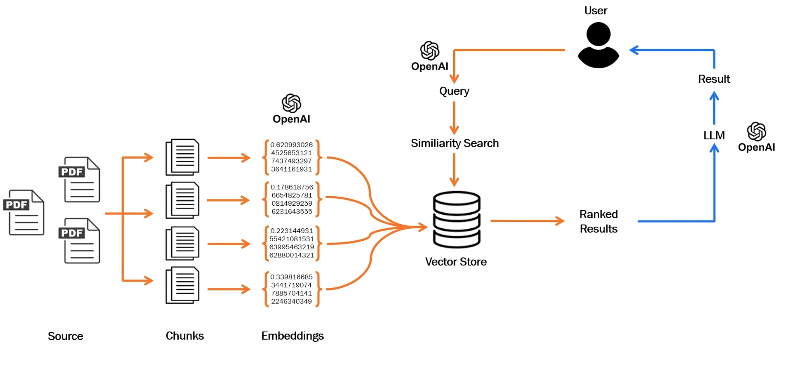

# genai
This is a GENAI tool where you can input your file and ask questions for which the tool will answer right.

If you want to replicate this follow these steps:

You can create this tool in your local's virtual env as well.
python3 -m venv .venv

source .venv/bin/activate

Run the file in terminal to get the output of path on how streamlit has saved your file. Accordingly run it.
Example - 
python3 ragchatbot.py 
streamlit run ragchatbot.py 

Dont forget to add your own OPENAI_API_KEY in ".env" file. An example is mentioned in ".env.example file". Since it is a secret-key, thats the only thing this repo expects you to input inside the code

Architecture:

